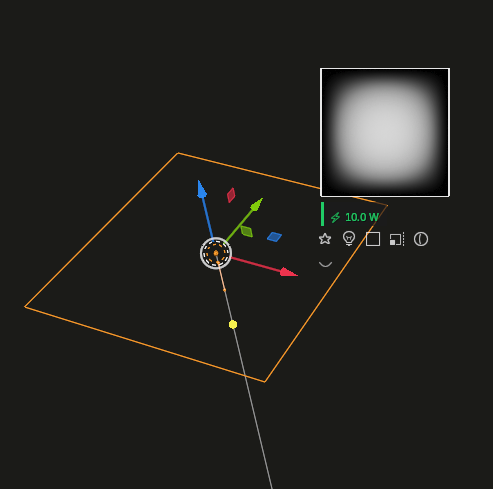
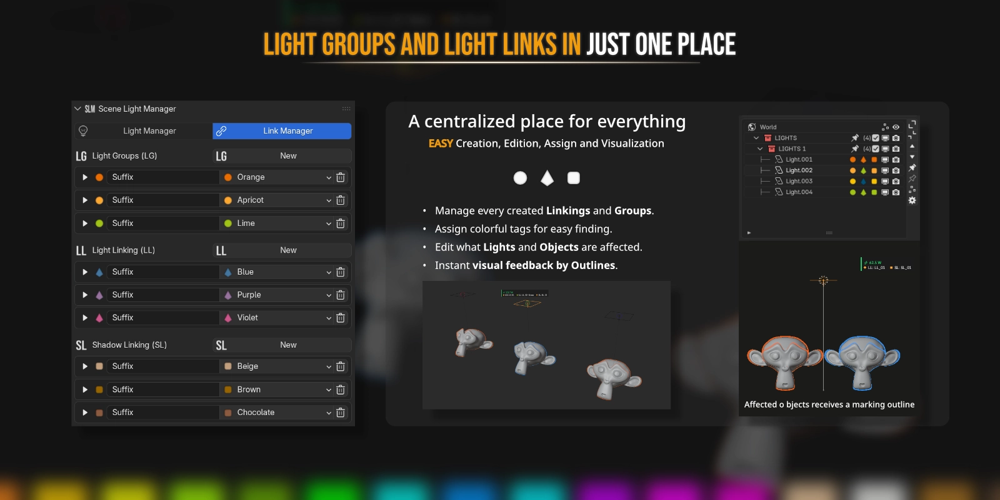
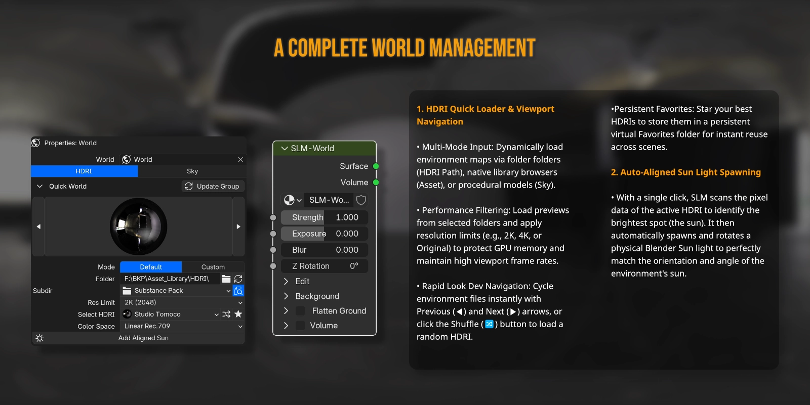
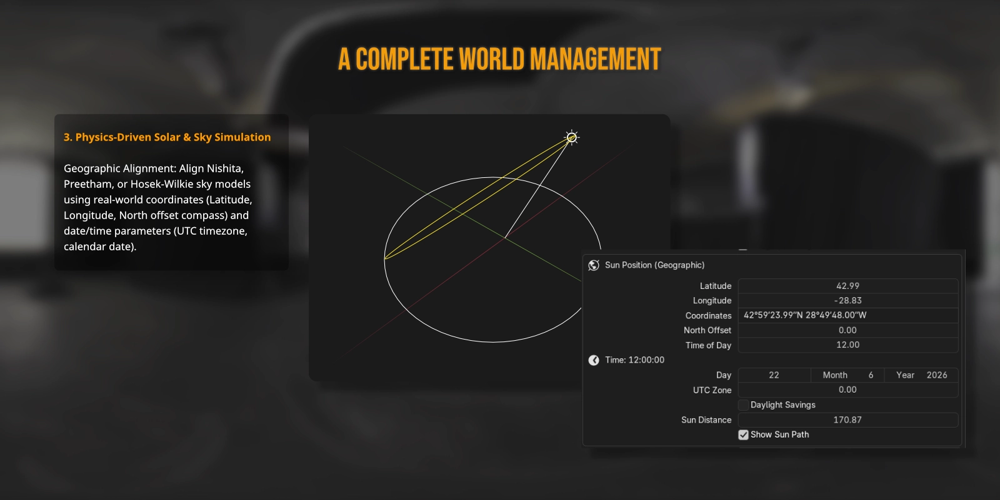
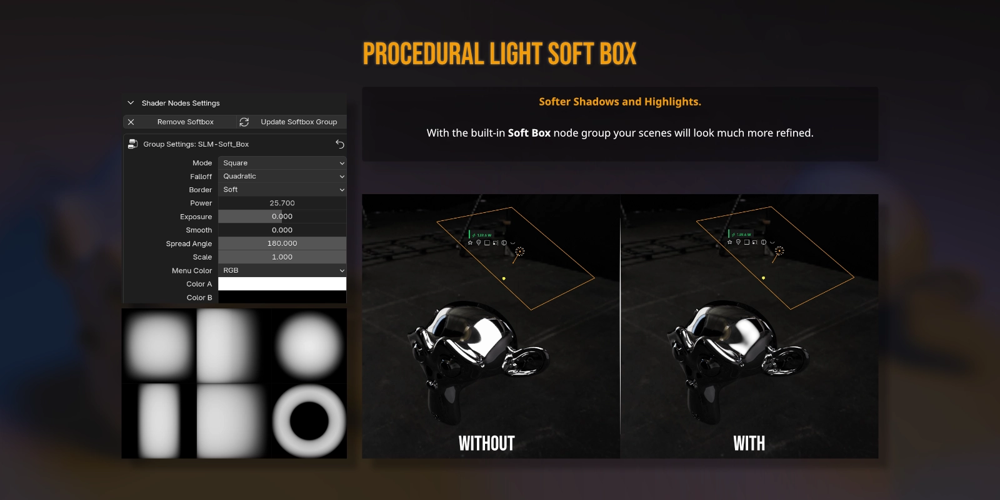
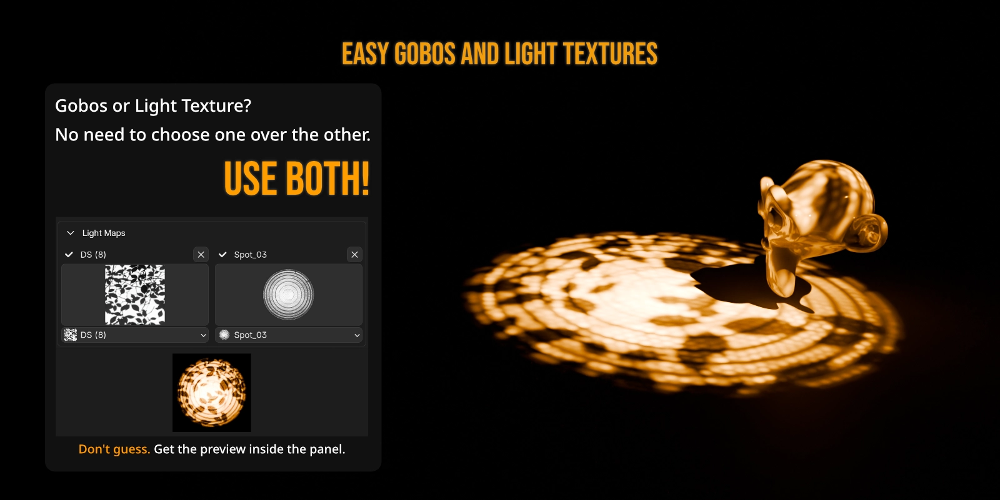
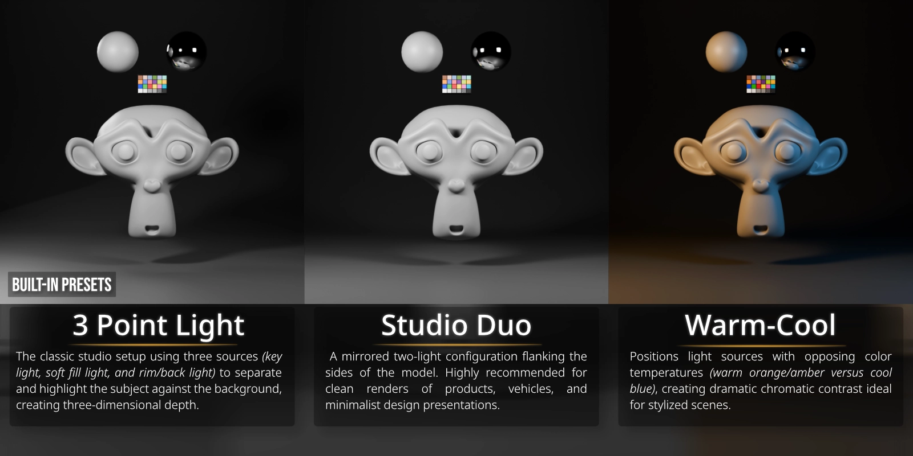
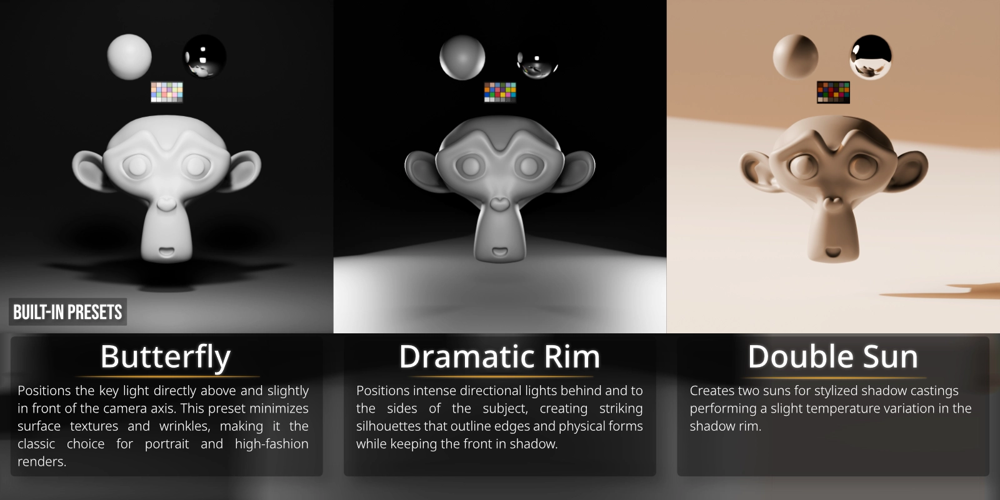
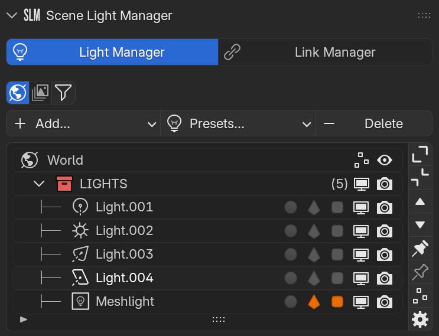
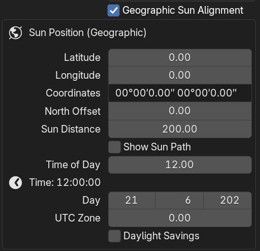

# 💡 Scene Light Manager (SLM) for Blender

**Stop fighting Blender’s interface just to light your scene.** 

Scene Light Manager (SLM) is a professional, high-fidelity lighting workflow toolkit designed to keep you in the creative flow. Adjust intensity, change shapes, solo lights, control HDRI rotation, and manage light/shadow linking **directly in the 3D Viewport** without ever opening the properties sidebar.

---

---

## 🚀 Why Scene Light Manager? (The SLM Difference)

In vanilla Blender, setting up cinematic lighting is a tedious loop: select a light, look at the properties panel, drag a slider, look back at the viewport, select another light, expand sub-panels, repeat. 

**SLM changes everything by bringing the controls to your cursor:**

*   **Zero Context Switching:** Adjust power, size, beam angle, and color directly on the light object inside the 3D Viewport.
*   **Instant Visual Feedback:** High-fidelity GPU outlines highlight exactly which objects are affected by light or shadow linking in real time.
*   **Intuitive Environment Controls:** Rotate your HDRI or position the Nishita sun texture with simple viewport gestures.
*   **Pure Performance:** Built from the ground up for heavy production scenes with zero overhead.

---

## 🌟 Key Features

### 1. Viewport Gizmo Interface & Floating Overlay
Gain instant, contextual access to light settings directly on the active light:
*   **Smart Buttons:** Click interactive icons next to your selected light to cycle types, change area shapes, toggle solo mode, adjust spot beam spreads, or tweak sizes.
*   **Real-Time Value Overlay:** Get beautiful, color-coded HUD feedback showing your precise parameter values as you drag. Choose to lock the HUD to your mouse or snap it cleanly below the gizmo cluster.
*   **Alt-Modifier Batch Control:** Hold `Alt` while adjusting a viewport gizmo to propagate the change to all selected lights instantly.

---

### 2. High-Fidelity GPU Linking Highlights
Configure Blender’s powerful Light and Shadow Linking systems visually:
*   **Visual Silhouette Outlines:** Selecting any light instantly projects clean, anti-aliased wireframes and silhouette highlights over the linked receiver or blocker geometry.
*   **Dynamic Customization:** Choose from three outline modes (*Silhouette*, *Wireframe*, or *Both*), and customize line thickness and colors to match your scene style.

---

### 3. Interactive HDRI & Sky Rotation
Ditch the shader editor mapping node. Rotate your environment from any camera angle:
*   **Auto-Detection Engine:** Automatically detects and rotates the active background environment—whether it is Nishita Sky, a World Mapping node (Z Rotation), or Blender's built-in Viewport HDRI.
*   **Instant Drag Gesture:** Hold `Ctrl + Alt + Right Mouse Button` and drag horizontally to spin the dome. Release to commit, or cancel with a right click.
*   **HUD Angle Readout:** A clean digital compass at the bottom of the viewport displays the exact rotation angle in real time.

---

### 4. HDR Studio Light Textures & Gobos
Project real-world high-dynamic-range softboxes and patterns directly from Blender Area Lights:
*   **Photographic Realism:** Map photographic softbox reflection textures and studio Gobos with a single click.
*   **Integrated Node Automation:** Behind the scenes, SLM handles shader setups, texture mapping coordinate projections, and strength balance.
*   **Interactive Tweaks:** Adjust Gobo rotation, scale, and softness directly from viewport operators.

---

### 5. Cinematic Presets & Custom Lighting Rigs
Build master lighting setups in seconds using built-in rigs and saving custom presets:
*   **Instant Rig Spawning:** Spawn standard 3-point rigs, butterfly setups, or backlighting rings aligned to your active viewport camera.
*   **Preset Library Manager:** Save complete scene lighting states to the global asset library and restore them instantly.
*   **Non-Destructive Mixing:** Test different lighting directions, colors, and intensities by saving snapshots as presets.

---

### 6. Smart Light Isolation (Solo Mode)
Isolate a single light source to judge its contribution, shadows, and bounce:
*   **Synchronized Soloing:** Solo any light via the viewport gizmo button or the sidebar list.
*   **Automatic Restores:** Un-soloing returns your scene to the exact previous visibility layout.
*   **World Muting Option:** Automatically disable the World background shader while soloing to isolate light color contributions in pure darkness.

---

### 7. Unified Light Manager Sidebar
A beautiful, tabbed panel consolidating every light source, emissive mesh, and setting in your project:
*   **Properties Tab:** Grouped list control over name, power, color, and visibility of all scene lights.
*   **Synchronization Tab:** Seamlessly synchronize viewport selections, automatically activate collections, or sync visibility parameters.
*   **Light List Tab:** Customize which property columns are visible (including icons for Light Groups, Light Linking, Shadow Linking, and Exposure Overrides).
*   **Mesh Emitters Detection:** Automatically scan and list mesh objects acting as lights via emissive shaders (using configurable search terms like `led`, `emit`, `glow`).

---

### 8. Geographic Sun & Sky Positioning
Align your Nishita sky or solar directional lights using real-world geographic coordinates:
*   **Latitude/Longitude Inputs:** Enter standard coordinates in Decimal format or degrees/minutes/seconds (e.g., `48°51'30.2"N 02°17'40.2"E`).
*   **3D Solar Path Overlay:** Projects a beautiful daily solar path arc and cardinal direction compass (North-South, East-West) inside the 3D viewport.

---

## ⌨️ Viewport Control & Shortcut Guide

### Global Hotkeys
| Action | Shortcut | Description |
| :--- | :--- | :--- |
| **Quick Popup** | `Y` | Open the Scene Light Manager quick settings popup under the cursor. |
| **Interactive HDRI Rotation** | `Ctrl + Alt + RMB` (Hold & Drag) | Spin the environment horizontally in the viewport. |

### Modal Navigation
| Key | Action |
| :--- | :--- |
| **Hold `Shift`** | Scale down mouse sensitivity for ultra-precise value tuning. |
| **Left Click / Enter** | Confirm changes and exit adjustment mode. |
| **Right Click / Esc** | Cancel changes and revert to the original value. |

---

## ⚙️ Modular Preferences
Tailor every detail of the interface to match your personal pipeline inside **Edit > Preferences > Add-ons > K-tools: Scene Light Manager**:
*   **Customize Gizmos:** Choose which buttons (Type, Shape, Size, Beam, Isolate) show up in the viewport.
*   **Clean Tabs Grid:** Choose between a grid or column layout for the preference panels.
*   **Custom Emissive Keywords:** Add your own terms to scan materials and automatically detect custom Mesh Lights.

---

*Developed by Robert Kezives. For support, feedback, or feature requests, visit the [Documentation Repository](https://github.com/r-kez/k_tools_slm_documentation).*
